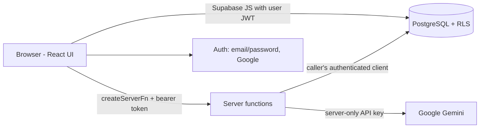

# KRYPTEDU — Smart Campus Analytics

> **Understand. Predict. Improve Student Success.**
> Built for **KPMG India Challenge 04**.

KRYPTEDU brings a student's academic performance, attendance, learning-platform (LMS) activity, campus engagement and placement preparation into one place. It calculates an explainable Student Success Score, flags academic and placement risk, groups students into segments, tracks support interventions, and provides two AI features powered by Google Gemini: **AI Insights** and the **Mock Interview Studio**.

---

## Table of contents

- [Overview](#overview)
- [Key features](#key-features)
- [Student Success Score methodology](#student-success-score-methodology)
- [User roles](#user-roles)
- [Architecture and technology stack](#architecture-and-technology-stack)
- [Database and data model](#database-and-data-model)
- [AI Insights](#ai-insights)
- [Mock Interview Studio](#mock-interview-studio)
- [Installation and local development](#installation-and-local-development)
- [Environment variables](#environment-variables)
- [Data import and expected formats](#data-import-and-expected-formats)
- [Security and privacy](#security-and-privacy)
- [Testing and verification](#testing-and-verification)
- [Deployment](#deployment)
- [Project structure](#project-structure)
- [Limitations and roadmap](#limitations-and-roadmap)
- [Contributing, license and acknowledgements](#contributing-license-and-acknowledgements)

---

## Overview

### The problem
Institutions usually keep grades, attendance, LMS activity, engagement and placement preparation in separate systems. Because no one sees the whole picture, a student who is struggling in several areas at once often isn't noticed until it's too late.

### The solution
KRYPTEDU combines these indicators per student and:

- calculates a single, explainable **Student Success Score** (0–100);
- classifies **academic risk** and **placement risk** (High / Medium / Low) with the specific reasons behind them;
- segments the cohort (Academic index × Placement index) and into actionable **support groups**;
- lets staff create, assign and track **interventions**;
- answers questions about the cohort with **AI Insights**, grounded in the database;
- lets students practise with an AI **Mock Interview Studio**.

### Intended users
Administrators, faculty, placement officers and students. Each role sees only what it is authorised to see. Access is enforced in the database, not only by hiding pages.

### Current status

| Capability | Status |
|---|---|
| Email/password and Google sign-in, pending-approval flow, role management | Implemented |
| Staff dashboard, student directory, profiles, score breakdowns, risk explanations | Implemented |
| Analytics, segmentation and support groups | Implemented |
| Interventions (create, edit, status, overdue/assignee filters, delete) | Implemented |
| CSV import with validation, duplicate detection and import history | Implemented |
| Reports (three CSV exports) | Implemented |
| Notifications with per-user read/unread state | Implemented |
| AI Insights (Gemini) | Implemented; depends on a Gemini API key with available quota |
| Mock Interview Studio with saved history | Implemented; depends on the same Gemini key |
| Student dashboard | Implemented; requires the account to be linked to a student record |


The dataset contains **36 synthetic students**. It contains no real student data.

---

## Key features

1. **Authentication and role-based access.** Email/password and Google sign-in. New sign-ups get the `pending` role and see an "Account pending approval" screen until an administrator assigns a role.
2. **Dashboards.** Staff see a cohort dashboard (`/dashboard`). Students are always sent to their own dashboard (`/student-dashboard`).
3. **Student directory and profiles.** Search by name or roll number, filter, sort by name, Success Score or attendance, and open a profile with the full score breakdown.
4. **Student Success Score.** Weighted score with the Academic index, Placement index and Engagement shown separately (see [methodology](#student-success-score-methodology)).
5. **Risk indicators.** Academic and placement risk levels plus plain-language risk factors (for example "Attendance below 75% (73%)").
6. **Analytics and segmentation.** Scatter-plot segmentation, department filter, and five clickable support groups.
7. **Interventions.** Create, edit, change status, assign, set due dates, filter by overdue and assignee, and delete with confirmation.
8. **Data Integration.** CSV import across six categories with validation and an import history.
9. **AI Insights.** Chat assistant that answers questions using the student data the signed-in user is allowed to see. Includes Stop, Retry and New Chat.
10. **Mock Interview Studio.** Generated questions, AI feedback scored against a rubric, a final summary and saved history.
11. **Reports and notifications.** Three CSV exports. Risk-alert and follow-up notifications whose read/unread state is saved per user.
12. **Profile and settings.** Account email, role, member-since date, last sign-in, change password and sign out. Includes a flip-style digital ID card with a QR code.
13. **Administration.** Administrators assign roles through a database function that blocks removing the last administrator.

---

## Student Success Score methodology

All scoring lives in **`src/lib/scoring.ts`** (tested in `scoring.test.ts`). The UI, reports and AI Insights all use these same functions, so the numbers always match.

```text
Success Score   = 0.45 × Academic index + 0.35 × Placement index + 0.20 × Engagement

Academic index  = 0.50 × (CGPA / 10 × 100) + 0.30 × Attendance + 0.20 × LMS activity − 5 × backlogs
Placement index = 0.50 × Placement readiness + 0.30 × Skills score + 0.20 × Feedback score
```

Every value is clamped to 0–100 and rounded.

| Component | Weight | Inputs |
|---|---|---|
| Academic index | **45%** | CGPA, attendance, LMS activity, backlogs |
| Placement index | **35%** | Placement readiness, skills, feedback |
| Engagement | **20%** | Campus engagement score |

### Risk rules

| Risk | High | Medium | Low |
|---|---|---|---|
| Academic | Academic index < 55, **or** backlogs ≥ 2, **or** attendance < 60% | Academic index < 70 **or** attendance < 75% | otherwise |
| Placement | Placement index < 45 | Placement index < 65 | otherwise |

### Segments and support groups
- **Segment:** "High"/"Low" Academic (index ≥ 65) × "High"/"Low" Placement (index ≥ 60). This gives four segments.
- **Support groups:**
  - Urgent support: high academic risk and high placement risk.
  - Strong academics, low placement: Academic index ≥ 65 and Placement index < 60.
  - Good academics, poor attendance: CGPA ≥ 7 and attendance < 75%.
  - Placement-ready, low risk: low academic risk and low placement risk.
  - Insufficient data: two or more indicators are missing (recorded as 0).
- **Risk factors** are listed per student, for example low CGPA (< 6), attendance < 75%, backlogs, LMS activity < 45, engagement < 40, placement readiness < 45, skills < 40.

> Example (fictional): CGPA 7.0, attendance 80, LMS 60, 0 backlogs → Academic index = 35 + 24 + 12 = **71**.

---

## User roles

Roles are stored in the `user_roles` table (enum `app_role`: `admin`, `faculty`, `placement`, `student`, `pending`). They are never stored on the profile and never taken from user-editable metadata.

| Capability | Admin | Faculty | Placement Officer | Student |
|---|:-:|:-:|:-:|:-:|
| Read all student records | ✅ | ✅ | ✅ | Own record only |
| Read feedback scores (via `student_feedback()`) | All | All | ❌ | Own only |
| Create/edit students, interventions, imports | ✅ | ✅ | ✅ | ❌ |
| Delete students | ✅ | ❌ | ❌ | ❌ |
| Read all mock-interview sessions | ✅ | Own only | ✅ | Own only |
| Assign roles / list all users | ✅ | ❌ | ❌ | ❌ |
| Staff pages (Analytics, Students, Interventions, Data Integration, Reports, AI Insights, Admin) | ✅ | ✅ | ✅ | Redirected to own dashboard |

**Admin.** Manages approvals and roles (`set_user_role`, `get_all_users`), has full institutional visibility including feedback, and can read all interview history. The database refuses to remove the last administrator.

**Faculty.** Reviews student academic data and profiles, identifies academic and attendance concerns, sees feedback, manages interventions, and uses Analytics and AI Insights. Cannot manage roles. The Admin page loads but returns no users, and role changes are refused.

**Placement Officer.** Reviews placement readiness and skills, finds students who need placement support, manages interventions and reads all mock-interview results. **Cannot read feedback scores.**

**Student.** Sees only their linked record on a personal dashboard, practises in the Mock Interview Studio, and sees their own interview history, notifications and profile. Every staff page redirects to `/student-dashboard`. The database returns no other student's data, even when requested directly.

> A student account must be linked to a record through `students.user_id`. Unlinked student accounts see no personal data.

---

## Architecture and technology stack

| Layer | Technology |
|---|---|
| Framework | **TanStack Start v1** (React 19, TypeScript), file-based routing with TanStack Router |
| Build | **Vite 7** |
| Styling | **Tailwind CSS v4** (tokens in `src/styles.css`), shadcn/ui (Radix), lucide icons, Recharts |
| Server logic | TanStack `createServerFn` server functions |
| Auth and database | **Lovable Cloud** (Supabase Auth + PostgreSQL), Row Level Security and SQL functions |
| AI | **Google Gemini** via `@google/genai`, called only from server functions |
| CSV | PapaParse |
| Tests | **Vitest** + Testing Library |
| Hosting | Lovable hosting and Vercel |



### Key flows
1. **Sign-in and authorisation.** `src/routes/_authenticated/route.tsx` checks the session and reads the role. It shows the pending screen for `pending` accounts and redirects students away from staff pages. The database enforces the real limits with RLS.
2. **Loading analytics.** The browser reads `students` (RLS-filtered), merges feedback from the `student_feedback()` function, and scores the data with `scoring.ts`.
3. **AI Insights.** The `src/lib/ai.functions.ts` server function checks the caller's role, loads only the data that caller is allowed to see, builds a grounded prompt and calls Gemini.
4. **Mock interviews.** The `src/lib/interview.functions.ts` server functions generate questions, evaluate answers and write the summary through `src/lib/gemini.server.ts`.
5. **Interview history.** Sessions are written with the caller's own authenticated client (RLS owner insert/update). No service-role key is needed.
6. **CSV import.** Parsing and validation run in the browser (`src/lib/csv.ts`). Valid rows update `students` by `roll_no`, and each run is logged in `data_imports`.

---

## Database and data model

Migrations live in `drizzle/migrations/`.

| Table | Purpose |
|---|---|
| `user_roles` | One role per user (`app_role` enum). Users can read only their own row and cannot write to it directly. |
| `students` | Canonical student record: roll_no, name, department, year, cgpa, attendance, lms_activity, engagement, placement_readiness, skills_score, feedback_score, backlogs, and `user_id` (link to a student account). |
| `interventions` | Support actions per student: title, category, priority, status, assigned_to, due_date, notes. |
| `data_imports` | CSV import history: category, filename, row count, status, message. |
| `notification_reads` | Per-user read state for notifications. |
| `interview_sessions` | Mock-interview questions, answers, evaluations, summary, overall score and status. |

| Function | Purpose |
|---|---|
| `has_role(uid, role)` / `is_staff(uid)` | Security-definer role checks used by policies (`is_staff` = admin, faculty or placement). |
| `student_feedback()` | Returns feedback scores. Admin and faculty get all rows, a student gets their own row, and others get none. |
| `get_all_users()` | Admin-only list of accounts and roles. |
| `set_user_role(target, role)` | Admin-only role assignment. Blocks removing the last admin. |
| `handle_new_user()` | Trigger that gives every new account the `pending` role. |

**Feedback privacy.** The `feedback_score` column cannot be selected directly by any app role. It is available only through `student_feedback()`.

---

## AI Insights

- **Purpose:** answer cohort questions such as "Which Civil students are at high risk?", using the student data the caller is allowed to see.
- **Flow:**
  1. The browser calls the server function with the user's bearer token.
  2. The server reads the caller's role (a pending account is refused).
  3. The server loads the permitted data: all students for staff, only the linked record for a student. Feedback is merged only where `student_feedback()` allows it.
  4. The data is scored with `scoring.ts`, and exact counts (by department, year and risk) are added to the prompt.
  5. Gemini is called.
- **Model:** `GEMINI_MODEL`, or **`gemini-3.5-flash`** when it isn't set.
- **Key:** `GOOGLE_API_KEY`, falling back to `GEMINI_API_KEY`. It is read only on the server.
- **Limits:** only the last 12 messages are sent, each cut to 4,000 characters. Requests time out after 45 seconds, with one bounded retry on 429/503.
- **Errors:** separate user-facing messages for quota reached, service overloaded, invalid model, rejected key, timeout, expired sign-in and offline. Unknown errors show a short reference code. Keys and stack traces are never shown.
- **No key configured:** the assistant returns calculated statistics and clearly labels them "AI integration is pending."
- **UI:** Stop cancels the wait in the browser. It may not stop work the provider has already started. Retry and New Chat are available, and failed or stopped replies are left out of later context.

---

## Mock Interview Studio

1. Choose a target role: Software Developer, Data Analyst, AI/ML Engineer or General Technical.
2. Choose an interview type: Technical, HR/Behavioral or Mixed.
3. Choose a difficulty: Beginner, Intermediate or Advanced.
4. Choose a length: 5, 10 or 15 questions.
5. **Start.** Gemini generates the questions, which are validated in `src/lib/interview.ts`.
6. **Answer** each question.
7. **Feedback.** Each answer is scored against a rubric:
   - Technical: correctness, relevance and completeness, problem-solving.
   - Behavioral: clarity, relevance, specific examples.

   The answer's score is the mean of its rubric scores, calculated on the server. Scores are labelled *indicative*.
8. **Summary.** Recurring weaknesses, topics to practise and next steps.
9. **History.** Saved in `interview_sessions`. Readable by the owner, admins and placement officers. Owners can create and update their own sessions. Nobody can delete them from the app.

---

## Installation and local development

**Requirements:** Node.js 20 or newer, and **Bun** (the repository uses `bun.lock`). npm also works.

```bash
git clone https://github.com/<your-org>/<your-repo>.git   # placeholder URL
cd <your-repo>
bun install
```

| Task | Command |
|---|---|
| Dev server | `bun run dev` |
| Tests | `bun run test` |
| Type check | `bunx tsc --noEmit` |
| Lint | `bun run lint` |
| Production build | `bun run build` |
| Preview build | `bun run preview` |

---

## Environment variables

Create a `.env` file in the project root for local development. **Never commit secrets.**

| Variable | Where | Purpose |
|---|---|---|
| `VITE_SUPABASE_URL` | Browser-safe | Backend URL |
| `VITE_SUPABASE_PUBLISHABLE_KEY` | Browser-safe | Publishable (anon) key; RLS still applies |
| `VITE_SUPABASE_PROJECT_ID` | Browser-safe | Project identifier |
| `SUPABASE_URL`, `SUPABASE_PUBLISHABLE_KEY` | Server-only | Used by server functions to validate the caller |
| `GOOGLE_API_KEY` (or `GEMINI_API_KEY`) | **Server-only secret** | Gemini API key |
| `GEMINI_MODEL` | Server-only (optional) | Overrides the default `gemini-3.5-flash` |

Only `VITE_*` variables reach the browser. On **Vercel**, add these under *Project → Settings → Environment Variables* and then **redeploy**. Changed variables only take effect on new deployments. A service-role key is **not** required.

---

## Data import and expected formats

- **File type:** CSV with a header row. Headers are trimmed and lower-cased.
- **Matching:** rows are matched to students by **`roll_no`** (required in every category).

| Category | Required columns |
|---|---|
| Academic | `roll_no`, `cgpa`, `backlogs` |
| Attendance | `roll_no`, `attendance` |
| LMS | `roll_no`, `lms_activity` |
| Engagement | `roll_no`, `engagement` |
| Placement | `roll_no`, `placement_readiness` |
| Skills and Feedback | `roll_no`, `skills_score`, `feedback_score` |

Optional columns: `year` (1–6), `name`, `department`.

- **Validation:**
  - cgpa must be 0–10, backlogs 0–30, and all other scores 0–100.
  - Invalid rows are reported by line number and skipped.
  - Missing required columns reject the whole file.
- **Duplicates:** a repeated `roll_no` within a file is reported and skipped.
- **History:** each import is recorded in `data_imports` and listed on the Data Integration page.
- **Limits:** no explicit file-size limit is enforced in code.

Example (fictional):
```csv
roll_no,attendance
KR2024099,82
```

---

## Security and privacy

- **Authentication:** handled by the backend's auth service (email/password, Google). New accounts stay `pending` until an admin approves them.
- **Authorisation in the database:** every table has RLS. Staff access uses `is_staff()`, and role changes go only through `set_user_role()`.
- **Student isolation:** a student can read only the `students` row linked to their account.
- **Feedback privacy:** the column cannot be selected directly; it is served only through `student_feedback()`.
- **Interview privacy:** owners, admins and placement officers can read sessions. Only the owner can write, and nobody can delete.
- **Secrets:** the Gemini key is read only inside server functions and never sent to the browser.
- **Safe errors:** user-facing messages contain no keys, stack traces or internal identifiers.
- **Route guards are a convenience only.** The database policies are the real boundary.

---

## Testing and verification

Automated tests (Vitest, `bun run test`; 50 tests passed at the time of writing):

| File | Covers |
|---|---|
| `src/lib/scoring.test.ts` | Score weights, indices, risk rules, segments |
| `src/lib/support-groups.test.ts` | Support-group rules |
| `src/lib/csv.test.ts` | CSV parsing, required columns, ranges, duplicates |
| `src/lib/interventions.test.ts` | Intervention logic |
| `src/lib/interview.test.ts` | Question/evaluation validation and score calculation |
| `src/test/security.test.ts`, `src/test/app-routing.test.tsx` | Security fallbacks and routing |

**Manual and browser testing carried out during development:**
- Student search and profiles.
- Intervention CRUD with persistence.
- CSV validation and history.
- Report exports.
- Notification isolation between two accounts.
- AI Stop/Retry and error handling.
- Import-driven score recalculation.
- Direct database requests per role (admin, faculty, placement, student).
- Student redirect away from staff pages.

**Outstanding:**
- Password-reset email delivery (no authorised test inbox).
- Repeated live AI checks, which depend on Gemini quota.

---

## Deployment

- **Build:** `bun run build` (Vite). No custom output settings are needed on Lovable hosting.
- **Vercel:** deploy from the intended production branch and set the [environment variables](#environment-variables).
- **Verifying a deployment:**
  1. Sign in.
  2. Open Profile and check the role shown.
  3. Ask AI Insights a question.
  4. Start a mock interview.
- **Logs:** use your hosting provider's function or runtime logs. AI requests log a request ID and timings, with no prompt content or keys.
- **Database migrations:** apply them only through reviewed migrations, never against production without review. Make additive, backward-compatible changes.

---

## Project structure

```text
src/
  components/       AppShell (navigation), IdCard, InterventionForm, kr (shared UI), ui/ (shadcn)
  integrations/     generated backend clients (do not edit)
  lib/
    scoring.ts      Success Score, risk, segments, support groups (single source of truth)
    csv.ts          CSV parsing and validation
    data.ts         query definitions and feedback merge
    ai.functions.ts AI Insights server function
    gemini.server.ts shared Gemini call
    interview.ts / interview.functions.ts  Mock Interview logic and server functions
  routes/
    index.tsx       sign-in / sign-up
    reset-password.tsx
    _authenticated/ dashboard, students, analytics, interventions, integration,
                    insights, interview, reports, notifications, profile, admin,
                    student-dashboard, more
drizzle/migrations/ database migrations
research/           offline research benchmarks, kept separate from app data
```

---

## Limitations and roadmap

- The data is synthetic (36 students). Production use needs real SIS/LMS integrations.
- AI quality and availability depend on Gemini quota and latency. Answers are not streamed.
- A student needs a linked record to see personal data, and linking currently requires administrator action.
- Forced password change on first sign-in is not available.
- Interview scores are indicative, not validated assessments.
- Possible next steps: student-to-account linking in the UI, scheduled data feeds, streamed AI answers.

---

## Contributing, license and acknowledgements

- **Contributing:** open an issue or pull request. Keep scoring changes in `src/lib/scoring.ts` with matching tests.
- **License:** no license has been chosen yet. Add a `LICENSE` file before public distribution.
- **Acknowledgements:** KPMG India Challenge 04. Built with TanStack Start, Tailwind CSS, shadcn/ui, Recharts, PapaParse and Google Gemini.
